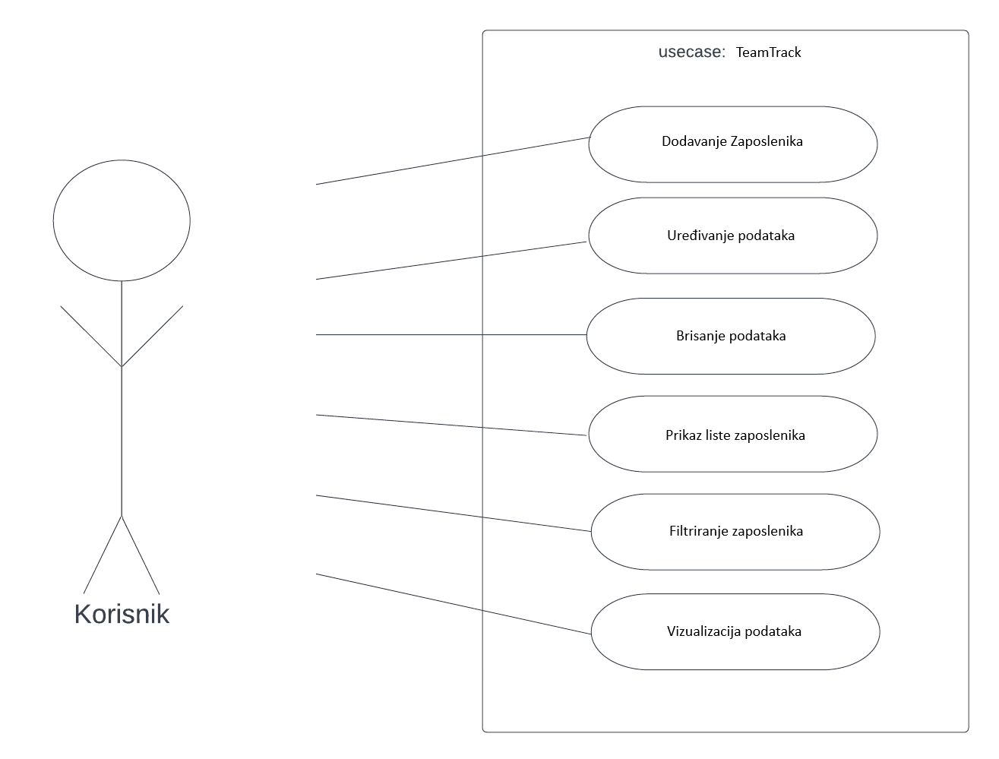

# STeamTrack

## **TeamTrack: Sustav za Upravljanje Zaposlenicima**

Projekt izrađen kao dio kolegija Informacijski sustavi na FIPU.

Projekt se fokusira na potrebu poslovnih subjekata za efikasnim vođenjem evidencije o zaposlenicima.

## Opis

TeamTrack je web aplikacija za upravljanje podacima o zaposlenicima koja omogućuje osnovne CRUD operacije – dodavanje, pregled, ažuriranje i brisanje podataka o zaposlenicima.
Aplikacija također podržava napredno filtriranje podataka i vizualizaciju ključnih metrika (npr. prosječna plaća po broju djece), pružajući bolji uvid u strukturu zaposlenika.
Backend je izrađen u Pythonu pomoću Flask okvira. Frontend koristi HTML, CSS, Bootstrap 5, Google Fonts (Poppins) i Font Awesome kako bi se osigurao moderan i responzivan dizajn. 

## UseCase dijagram

## Pokretanje aplikacije
Aplikacija se pokreće pomoću Docker Desktop-a nakon što se prvo **izradi docker image**.
Aplikaciju je moguće koristiti u pregledniku: **localhost:5000**

**Mario Hajnić**, FIPU